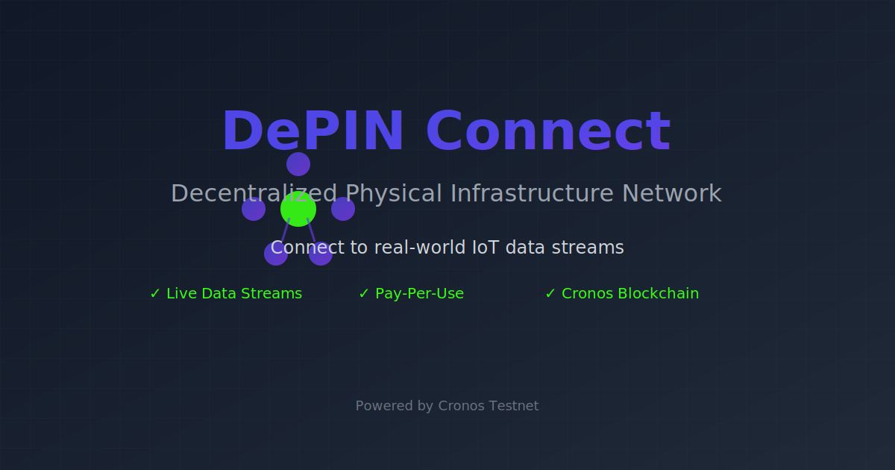

# DePIN Connect

**Decentralized IoT Data Marketplace with x402 Payment Protocol on Cronos**

---

## The Problem

IoT devices generate billions of data points daily, but monetization remains broken:

- **Providers** can't easily sell their sensor data
- **Buyers** face high costs and vendor lock-in
- **No micro-payments** for pay-per-use data access
- **Trust issues** between strangers exchanging data

Current solutions require monthly subscriptions, complex integrations, and middlemen taking large cuts.

---

## Our Solution

**DePIN Connect** bridges the physical and digital worlds using blockchain and the **x402 payment protocol**:

✅ **Real-time Payment Streams** - Pay per second for data access, stop anytime  
✅ **x402 Protocol** - Industry-standard payment headers unlock data automatically  
✅ **Smart Contract Automation** - No escrow, no disputes, code enforces fairness  
✅ **Decentralized Discovery** - Interactive map marketplace for IoT data streams  
✅ **AI-Powered Validation** - Agent monitors quality and event compliance  

**Key Innovation:** Combines blockchain payment streams with HTTP 402 (Payment Required) standard, creating true pay-per-use data APIs.

---

## What is x402?

The **x402 protocol** extends HTTP's "402 Payment Required" status code for Web3:

\`\`\`http
GET /api/device/weather-station-001/data
X-Payment-Address: 0x742d35Cc6634C0532925a3b844Bc9e7595f0bEb
Authorization: Bearer <signature>

→ Server checks blockchain for active subscription
→ If paid: Return data
→ If not: 402 Payment Required
\`\`\`

This enables:
- **Automatic access control** based on on-chain payments
- **No API keys** - your wallet is your authentication
- **Transparent pricing** - rates locked in smart contracts
- **Instant activation** - subscribe and access immediately

---

## How It Works

### For Data Providers (Earn Passive Income)

1. **Register Device** - Add your IoT sensor to DePINRegistry smart contract
2. **Set Data Schema** - Define what data you're providing (JSON format)
3. **Configure Pricing** - Set your rate (e.g., 0.001 CRO per second)
4. **Start Earning** - Get paid automatically as buyers access your data

### For Data Buyers (Pay Only for Usage)

1. **Browse Marketplace** - Discover devices on interactive map
2. **Subscribe** - Deposit CRO for time-based access (e.g., 10 CRO = ~3 hours)
3. **Access Data via API** - Use x402 headers to authenticate and fetch real-time data
4. **Stop Anytime** - Unused deposit automatically refunded

### Technical Flow

\`\`\`
Buyer Subscribes → PaymentStream Contract → Payment Locked
        ↓
Buyer Requests Data → x402 Middleware → Checks Blockchain
        ↓                                       ↓
   Has Active Stream?                    Deposit > 0?
        ↓ YES                                  ↓ YES
   Return Data ← ← ← ← ← ← ← ← ← ← ← ← Access Granted
        ↓ NO
   402 Payment Required
\`\`\`

---

## Deployed Smart Contracts

| Contract | Address | View on Explorer |
|----------|---------|------------------|
| **DePINRegistry** | \`0xfd2f67cD354545712f9d8230170015d7e30d133A\` | [Explorer →](https://explorer.cronos.org/testnet/address/0xfd2f67cD354545712f9d8230170015d7e30d133A) |
| **PaymentStream** | \`0xA5dd225Beb2Ec0009Fe143eb0B9309Ba07d23737\` | [Explorer →](https://explorer.cronos.org/testnet/address/0xA5dd225Beb2Ec0009Fe143eb0B9309Ba07d23737) |

**Network:** Cronos Testnet | **Chain ID:** 338 | **RPC:** \`https://evm-t3.cronos.org/\`

---

## Roadmap

### ✅ Phase 1: MVP (Completed)
- Smart contracts with payment streams
- Interactive marketplace with map
- Device registration & management
- Real-time subscriptions
- AI agent event monitoring

### 🚧 Phase 2: x402 Data API (2 weeks)
- REST API server with data endpoints
- x402 payment verification middleware
- Mock IoT data generators
- WebSocket real-time streaming
- Frontend data viewer
- Historical data access

**Impact:** Buyers can fetch actual sensor data; true pay-per-use marketplace

### 📋 Phase 3: Production (Q1 2026)
- Real IoT device integration (MQTT/HTTP)
- Provider analytics dashboard
- Reputation system
- Data quality scoring

### 🎯 Phase 4: Scale (Q2 2026)
- Mainnet deployment
- Mobile apps
- Cross-chain support
- Enterprise features

---

## Quick Start

**Prerequisites:** MetaMask + Cronos Testnet + Test CRO

1. Connect wallet at marketplace
2. **Provider:** Dashboard → Register device ([schemas](DEVICE_SCHEMAS.md))
3. **Buyer:** Marketplace → Subscribe (10 CRO = ~3 hours)

---

## Documentation

- [TESTING_GUIDE.md](TESTING_GUIDE.md) - Full testing instructions
- [DEVICE_SCHEMAS.md](DEVICE_SCHEMAS.md) - Sample IoT schemas
- [VERCEL_DEPLOY.md](VERCEL_DEPLOY.md) - Deploy frontend

---

## Tech Stack

**Blockchain:** Cronos (Solidity 0.8.20, Foundry, OpenZeppelin)  
**Frontend:** React 18 + TypeScript + Vite + Tailwind + Ethers.js  
**Backend (Roadmap):** Node.js + Express + x402 middleware  
**Agent:** Event listener for StreamStarted logs

---

**Built with ❤️ on Cronos** | *Decentralizing the Internet of Things*
